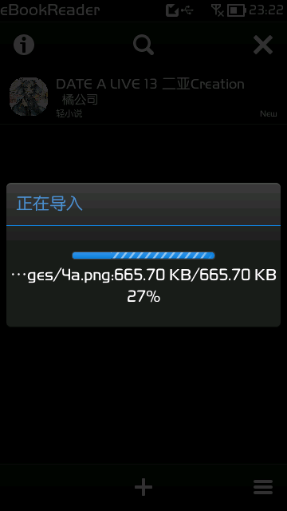
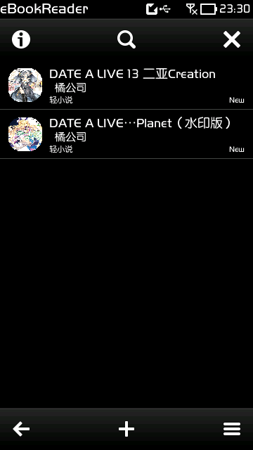
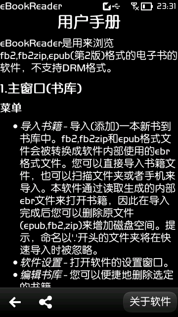
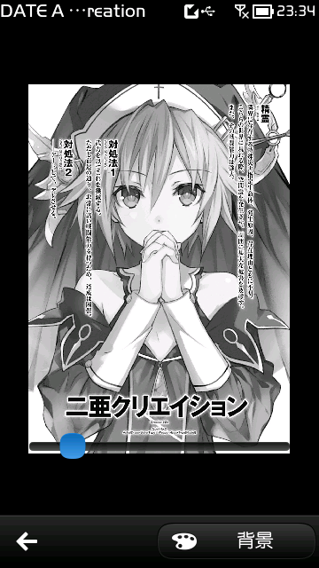

# eBookReader for Symbian^3 zh-CN
[English](./README.md) 简体中文   
   
eBookReader汉化版   
官网: https://ebookreader.abcreiseonline.de/?q=reader   
提供商: [ArtSoftic](https://ebookreader.abcreiseonline.de)   
Ovi商店/诺基亚应用商店: http://store.ovi.com/content/264420   
Opera Mobile Store: http://symbian.apps.opera.com/ebookreader.html   
Bemobi Mobile Store: http://symbian.oms.apps.bemobi.com/zh_cn/ebookreader.html   

## 官方介绍
### 描述
eBookReader is a powerful and flexible application developed by ArtSoftic for reading eBooks on Symbian^3 devices, in formats EPUB (non DRM), FB2 (.ZIP). The natural look &amp; feel and the intuitive user interface will engage you in an exceptional experience. In addition, the application is packed with follow the features you may need ( epub and fb2 import, bookmarks, library, hyperlinks, image viewer, etc.). Automatic encoding detection, table contents is supported too.
### 问答
1. What ebook formats supported?   
The eBookReader is only designed for FB2 and ePub formats (ePub Version 2), without any support Adobe DRM (Adobe ePub with DRM) or Adobe PDF, etc.

2. Where to download books?   
Some ebooks stores find you in section "eBooks Websites".
More ebooks find you on the Web, search in Google for "fb2 for free" or "epub for free".

3. How to load the ebook in eBookReader?   
For example, if you download a file (epub or fb2) from m.gutenberg.org into the directory `"e:\download"`, in the function "+" (menu->import->import from file) you must select to first `"e:\"`, then `"download"`. You can also download books from your PC into any directory on your mobile phone. Then you'll have to go into this directory, in the "+" (menu->import->import from file) function.    
You can also use the express - import function (menu->import->express import->improt from phone or import from folder).

4. How to quickly remove a readed book from library?   
A long press on the ebook record in the library, then "Delete".   
If you want to immediately delete all readed books from the library, go to the edit mode. Then in menu choose "Select all finished books" , after this "Delete selected books".
## 汉化版截图

## 久店(9Smart Store)应用详情备份
### 应用详情
操作系统：Symbian^3   
应用分类：阅读办公   
应用名称：eBookReader   
最新版本：1.7.1   
开发厂商：Oleg Diener   
唯一标识：0x200617AA   
打包时间：2013/13/23   
证书日期：unsigned   
### 应用介绍
eBookReader是一个支持epub，fb2，zip格式的电子书阅读软件，软件有一个直观的用户界面，此外，软件还包含了epub和fb2导入书签功能、书库管理、图片浏览器功能等等，支持多种编码，支持超链接，支持表格自动检测。   

这绝对是塞班平台上最好的电子书阅读器！唯一的缺点就是要把用户的电子书转换成软件内部使用的ebr文件，占用了太多空间。   
### 官方更新详情
2013/13/23更新1.07(1)   

1.07(1)更新日志   
-实验性支持epub(version3)   
## 关于本仓库
### 1.07(1)
#### 2016/07/04
修复AboutColumn.qml中一处翻译错误
#### 2016/07/01
发布1.07(1)汉化版。   

这里提供的是Dealtz汉化的版本。   

-此版本为单语言版无`.qm`语言包，所以仅汉化了`.qml`文件，书籍状态、颜色名称和对齐方式的弹出框未汉化；   
-修正了低版本Qt平台和某种情况下的汉化文本乱码的问题；   
-按钮边框太丑所以全部去除了；   
-高级设置里增加了保存设置的按钮；   
-部分翻译在尊重原文的基础上增加大量说明性文字；   
-用户手册里加入个人吐槽。   

*软件需要Qt平台支持   
*这里提供的是汉化的版本，所以unsigned   
*原版signed until 2016/05/16
#### 2013/12/23
官方1.07(1)版已在诺基亚应用商店上架。   
*这一版是仅有英语的单语言版本。   

1.07(1)更新日志   
-实验性支持第三版epub格式
### 1.07(0)
#### 2016/07/01
在Kaiyangx汉化文本的基础上进行校对、润色和恢复不该汉化的英文；   
UI修正（去除按钮边框）和添加说明性文字；   
更改汉化方式，修正了低版本Qt平台和某种情况下的中文乱码的问题。   
By Dealtz
#### 2013/??/??
软件qml和qm语言包汉化以及sis包更换支持语言为中文(r31) by Kaiyangx。
#### 2013/06/03
官方1.07(0)版已在诺基亚应用商店上架。   
*这一版是英语和俄语的双语言版本。    

1.07(0)更新日志   
-在图像查看器中设置背景颜色   
-整合eBookReader官方网页
### 1.06(0)
#### 2013/??/??
软件qml汉化和qm语言包移除 by Fanxi。
#### 2013/01/19
官方1.06(0)版已在诺基亚应用商店上架。   
*这一版是英语和俄语的双语言版本。   

1.06(0)更新日志   
-支持将文本复制到剪贴板上   
-快速导入书籍   
-Bug修复
## 其他说明
本仓库仅提供1.06(0)、1.07(0)和1.07(1)的非官方汉化版本。   
应用在1.07(2)更新时加入了官方德语`.qm`语言包，正式支持英语俄语和德语三种语言。   
我在2014年时忘记收集官方版本和由@kaiyangx翻译的1.07(2)版本了，所以抱歉不能提供最新的1.07(2)版本。如果你有此版本的`.sis`塞班安装包，还请创建一个issue并上传`.sis`文件给我，十分感谢！